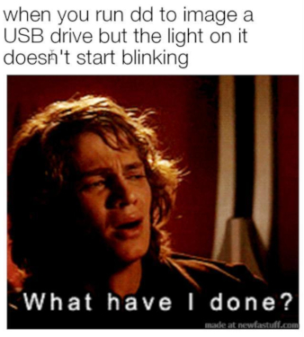

Me parece un buen arranque para el blog, compartir mi método para crear un usb booteable Linux desde un archivo iso. Ademas, voy a intentar explicar un poco que función cumple cada parámetro. La idea de esto es practicar el `compartir informacion` de manera útil y no a forma de porta-papeles. 

Para hacer esto, utilizo la herramienta [`dd`](https://es.wikipedia.org/wiki/Dd_(Unix)).
> dd copia el archivo indicado como origen en el archivo indicado como destino, teniendo en cuenta la conversión de los datos y el tamaño de bloque requerido.([Wikipedia](https://es.wikipedia.org/wiki/Dd_(Unix))).

El primer requisito es descargar una imagen `.iso` (Sugiero probar con el net-install de [Debian](https://cdimage.debian.org/debian-cd/current/amd64/iso-cd/debian-10.4.0-amd64-netinst.iso)). 

Luego en una terminal ejecutamos: 
```
sudo dd bs=4M if=${ISO} of=${/dev/sdX} oflag=sync status=progress
```



Paso a explicar:
* `bs=4M`: Indica cuantos Bytes de escriben y leen a la ves. (ibs y obs) 
* `if=${ISO}` y `of=$[/dev/sdX]`: `if=` indica el origen del archivo y `of=` el destino.
* `oflag=sync`: Limpia los buffers del filesistem (esto nos asegura que el contenido se copie antes de quitar el usb)
* `status=progress`: Nos indicara el proceso de la copia en tiempo real. 

Para mas información del comando y sus parámetros, sugiero un `man dd`. 

.
